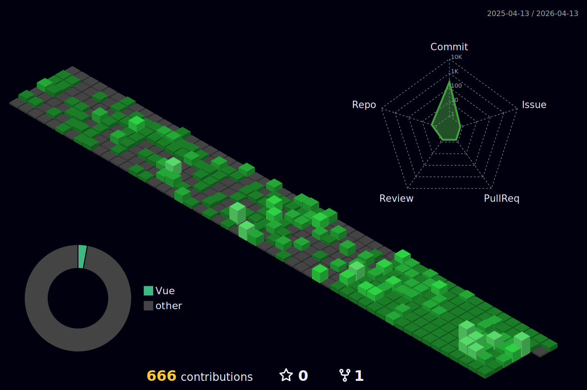

<h1 align="center">Hi 👋, I'm TAQ</h1>
<h3 align="center">A passionate Front-end developer from Viet Nam</h3>

## What I Do

I am a Front-end Developer specializing in building and deploying scalable web applications.  
With a strong focus on performance, UI/UX, and clean architecture, I enjoy turning complex problems into simple, elegant solutions.

### Technologies and Tools

Here are some of the technologies and tools I work with:

<!-- 

 -->

## 📊 My 3D Contributions

  

